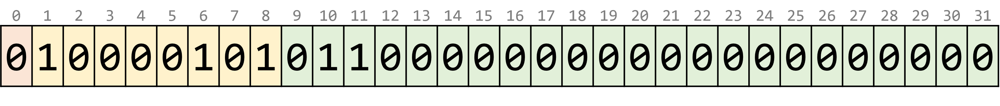
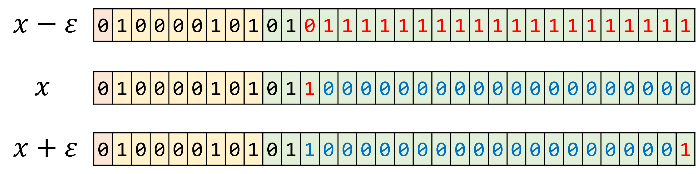
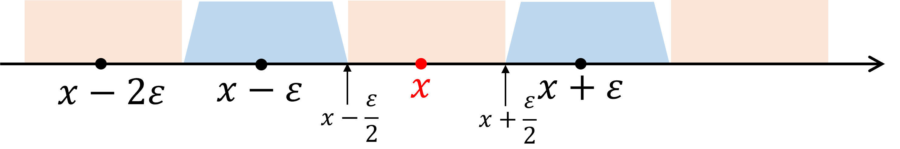
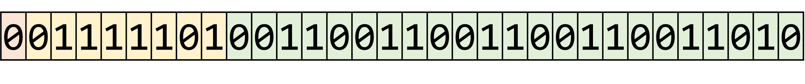

---
jupytext:
  formats: md:myst
  text_representation:
    extension: .md
    format_name: myst
kernelspec:
  display_name: Python 3
  language: python
  name: python3
---

# IEEE754規格

計算機で浮動小数点数を扱う方法には数多くの種類が考えられるが，現在では概ね統一されている。

浮動小数点方式の仕様を定める事実上の標準規格は IEEE 754 である。
IEEE（アイ・トリプル・イー）とは，Institute of Electrical and Electronics Engineers（米国電気電子学会）の略であり，IEEE 754 の他にも多くの国際標準規格を策定している団体である。

IEEE 754 の規格名は "IEEE Standard for Floating-Point Arithmetic" であり，その名の通り，浮動小数点数の表現・丸め規則・四則演算などを定めている。
本企画策定の代表者であるウィリアム・カハン（William Morton Kahan）は，「数値解析への根本的貢献に対して」1989 年チューリング賞を受賞した。

IEEE 754 で定められている浮動小数点数には，精度の異なるいくつかの種類がある。
なかでも重要なのは以下の 2 つである。

- 単精度（single precision）: 32 ビット
- 倍精度（double precision）: 64 ビット

これらはいずれも2進法に基づく規格である。その他に十進法に基づく規格も定められているが，ここでは省略する。

## 単精度浮動小数点数

単精度では 1 つの数を 32 ビットで表現する。
その内訳は以下の通りである。

- 符号 $s$: 1 ビット
- 指数 $E$: 8 ビット
- 仮数 $F$: 23 ビット

$s,E,F$ をそれぞれ 2 進法の整数と解釈するとき，表現する値は

$$
(-1)^s \cdot 2^{E-127} \cdot \left( 1 + \frac{F}{2^{23}} \right)
$$

である。

符号ビット $s$ は値の符号 +/- を 1 ビットで表現する。符号ビット $s$ が 0 であれば符号は + であり，1 であれば符号は - である。

指数ビット $E$ は指数部を 8 ビットで表す。
ただし，2の補数表示ではなく，指数部 $e$ の代わりに $E = e + 127$ を用いる。
また，指数ビット $E$ の値として $0$ や $255$ は特別な値を表現するために予約されている。
したがって，通常の数の指数 $e$ として表現できるのは $-126$ から $+127$ までに限られる。

仮数ビット $F$ は，仮数部の小数部分をそのまま表す。
たとえば仮数部が $1.0011_{(2)}$ であれば $F=0011_{(2)}$ となる。
仮数部は整数部分が $1$ になるよう正規化されているため，整数部分を省略できる。
これは **隠しビット**（hidden bit） や **けち表現**（economized form） と呼ばれる。
この工夫により，単精度の有効桁数は仮数ビットより 1 ビット多い 24 ビットとなる。

````{prf:example}
:label: example-ieee754-1

たとえば，$x = 88 = +1.375 \times 2^6$ を IEEE 754 単精度で表現すると，

```text
符号 指数      仮数
0    10000101  01100000000000000000000
```

となる。



まず，符号ビット `0` は符号が $+$ であることを表す。

次に，指数ビット `10000101` は 10 進数で $133$ であるが，これは $E = e + 127 = 133$ すなわち指数が $e=6$ であることを表す。

最後に，仮数ビット `01100000000000000000000` は仮数が $1.01100000000000000000000_{(2)} = 1.375$ であることを表す。
````

上の事実を Python で確認してみよう。

```{code-cell}
from struct import pack
x = 88.0
s = ''.join([f'{b:08b}' for b in pack('>f', x)])
h = ''.join([f'{b:02x}      ' for b in pack('>f', x)])
print('bin:     ', s)
print('hex:     ', h)
print()
print('sign:    ', s[0])
print('exponent:', s[1:9])
print('fraction:', s[9:])
```

### 丸めモード

有限小数にならない数や仮数部が 24 ビットに収まらない数を表現するには，値を丸める必要がある。
丸め誤差を小さく抑えるために IEEE 754 では **最近点への丸め**（round to nearest）を用いる。
さらに，もし最近点が 2 つ存在する場合は，仮数部の最下位ビットが $0$ になる方を選択する。
これを **偶数への丸め**（round to even）と呼ぶ。
これが IEEE 754 の丸めモードのデフォルトである。

他の丸めモードには以下のようなものがあり，必要に応じて切り替えることができる。
- 上向きの丸め（round upward）: その数以上の最小の数に丸める。
- 下向きの丸め（round downward）: その数以下の最大の数に丸める。
- 切り捨て（round toward 0）: $0$ に近い方に丸める。つまり，正ならば下向き，負ならば上向きに丸める。

````{prf:example}
:label: example-ieee754-2

IEEE 754 単精度において，値 $x = 88 = 1.375 \times 2^6$ の両隣の数は $x \pm \varepsilon$ である。ただし $\varepsilon = 2^{6-23}$ とする。



閉区間 $\left[ x-\frac{\varepsilon}{2}, x+\frac{\varepsilon}{2} \right]$ の数は $x$ に丸められる。

開区間 $\left( x-\frac{3\varepsilon}{2}, x-\frac{\varepsilon}{2} \right)$ の数は $x-\varepsilon$ に丸められる。


````

````{prf:example}
:label: example-ieee754-3

$x=0.3$ を IEEE 754 単精度で表現する。

$0.3 = + \dot{1}.00\dot{1} \times 2^{-2}$ であるから，IEEE 754 による表現は次の図のようになる。



この近似値を正確に 10 進数に復号すると

$$
\hat{x} = 0.3000000{\color{red}11920928955078125}
$$

となり，$0.3$ とは一致しない。両隣の数は

$$
\begin{align*}
0.2999999{\color{red}821186065673828125}
\\
0.3000000{\color{red}417232513427734375}
\end{align*}
$$

であり，たしかに $0.3$ から最も近いのは $\hat{x}$ である。
````

### 機械イプシロン

一般に，浮動小数点数の有効桁数が $t$ であるとき，相対誤差限界は $2^{-t}$ である。
これを **丸めの単位**（unit round off）とよぶ。

また，浮動小数点数で表現できる数のうち $1$ より大きい最小の値と $1$ との差を **機械イプシロン**（machine epsilon）とよぶ。
有効桁数が $t$ であるとき，機械イプシロンは $2^{1-t}$ である。

IEEE 754 単精度の仮数ビット幅は $23$ であり，隠れビットを含めると有効桁数は $24$ であるから，丸めの単位は $2^{-24}$，機械イプシロンは $2^{-23}$ である。

## 特殊な数

### 非数（NaN; Not a Number）

浮動小数点数ではゼロや無限大などを特殊な値として扱う。

たとえば，$0 \div 0$ の値は通常の数学では定義されないが，IEEE 754 では `0.0 / 0.0` の演算結果が NaN という特殊な値になることが定められている。

モダンなプログラミング言語である Java や Python では $0 \div 0$ の際に例外が発生してプログラムが停止するようになっている。例外が発生すると演算結果が確認できない。
C 言語では例外が存在しないため $0$ で割った結果を確認できる。
Python において IEEE 754 の仕様にしたがう $0 \div 0$ の結果を確認するためには，NumPy という数値計算のためのライブラリを使えばよい。

```{code-cell}
import numpy as np
x = np.float32(0)
print(x / x)
```

NaN の内部表現は一定ではない。

- 符号ビットは任意の値をとる。
- 指数ビットはすべて $1$ である。すなわち単精度なら $E=11111111_{(2)}=255$ であり，倍精度なら $E=11111111111_{(2)}=2047$ である。
- 仮数部は $0$ 以外の任意の値をとる。

```{code-cell}
from struct import pack

def print_ieee754_single(x):
    s = ''.join([f'{b:08b}' for b in pack('>f', x)])
    print('bin:       ', s)
    print('  sign:    ', s[0])
    print('  exponent:', s[1:9])
    print('  fraction:', s[9:])

def print_ieee754_double(x):
    s = ''.join([f'{b:08b}' for b in pack('>d', x)])
    print('bin:       ', s)
    print('  sign:    ', s[0])
    print('  exponent:', s[1:12])
    print('  fraction:', s[12:])

x = float('nan')
print_ieee754_double(x)
```

### 無限大

IEEE 754 単精度で表現できる最大の数は $1.11111111111111111111111_{(2)} \times 2^{127} = (2-2^{-23}) \cdot 2^{127}$ すなわち約 $3.4028 \times 10^{38}$ である。
倍精度では約 $1.7977 \times 10^{308}$ まで扱うことができる。
これより大きい値は **無限大**（infinity）として扱われる。

```{code-cell}
print(1.7976e308)
print(1.7977e308)
```

無限大の内部表現では，非数 NaN と同じく指数部がすべて $1$ となる。
また，正の無限大と負の無限大を区別する。

- 符号ビットは，正の無限大では $0$ となり，負の無限大では $1$ となる。
- 指数ビットはすべて $1$ である。すなわち単精度なら $E=11111111_{(2)}=255$ であり，倍精度なら $E=11111111111_{(2)}=2047$ である。
- 仮数ビットはすべて $0$ である。

```{code-cell}
x = float('inf')
print(x)
print_ieee754_double(x)
print()
x = float('-inf')
print(x)
print_ieee754_double(x)
```

浮動小数点数の無限大 `inf` は特殊な「数」であり，$1$ を `inf` で割るというようないくつかの演算が定義されている。数学において，極限の計算の際に無限大 $\infty$ を便宜的な数と扱える場合があるのと似ている。

```{code-cell}
x = float('inf')
print(1 / x)
```

### 符号付きゼロ

浮動小数点数では，ゼロは厳密な $0$ でなく，一般には誤差を含む。
したがって，非常に小さな絶対値を持つ値を表しているとも考えられ，その結果，正または負の符号が意味を持つ場合がある。

IEEE 754 単精度で表現できる（正規化された）数のうち絶対値が最小の数は $1.00000000000000000000000_{(2)} \times 2^{-126} = 2^{-126}$ すなわち約 $1.1755 \times 10^{-38}$ である。
倍精度では約 $2.2251 \times 10^{-308}$ まで扱うことができる。
これよりもゼロに近い値は $0$ に丸められる。

IEEE 754 では，浮動小数点数の正規化によって，最上位ビットが一の位にくるよう調節することになっているが，$0$ は最上位ビットを持たないため，例外として扱う必要がある。

ゼロの内部表現では，指数ビットも仮数ビットもすべて $0$ となる。

- 符号ビットは，正のゼロでは $0$ となり，負のゼロでは $1$ となる。
- 指数ビットはすべて $0$ である。
- 仮数ビットはすべて $0$ である。

```{code-cell}
x = +0.0
print(x)
print_ieee754_double(x)
print()
x = -0.0
print(x)
print_ieee754_double(x)
```

### 非正規化数

上で述べたように，IEEE 754 単精度で表現できる正規化数のうち絶対値が最小の数は $1.00000000000000000000000_{(2)} \times 2^{-126} = 2^{-126}$ である。

仮数部を正規化せずに $0.01 \times 2^{-126}$ のような表現を認めれば，より小さな数を扱える。正規化されていない仮数を扱うためには，隠れビットが $1$ でなく $0$ であることを何らかの方法で方法する必要がある。

非正規化数の内部表現では，指数ビットは $0$ であるが仮数ビットは $0$ 以外の値をとる。

- 符号ビットは，正規化数と同じ意味を表す。
- 指数ビットはすべて $0$ である。
  - ただし，表現する指数部 $e$ は $e = E - 127 = -127$ でなく $-126$ である点に注意が必要。
- 仮数ビットはすべて $0$ 以外である。

Python で非正規化数が扱えることを確かめてみよう。

```{code-cell}
import numpy as np

print('正の正規化数のうち最小の値 ε_min')
x = np.float32(2**-126)
print(x)
print_ieee754_single(x)
print()

print('非正規化数（ε_min より小）')
x = np.float32(2**-127)
print(x)
print_ieee754_single(x)
print()

print('非正規化数（ε_min よりさらに小）')
x = np.float32(2**-149)
print(x)
print_ieee754_single(x)
print()

print('小さすぎるとゼロになる')
x = np.float32(2**-150)
print(x)
print_ieee754_single(x)
print()
```

非正規化数があることによって，相異なる浮動小数点数どうしの差がゼロに丸められることがないことが保証される。
